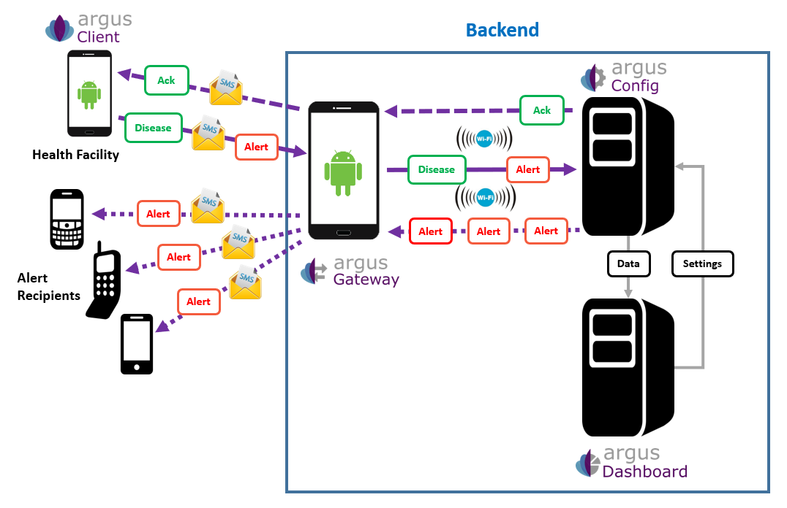

# Argus Solution

The **Argus Solution** is made of the following software components:
+ **The Argus Client**. It is the Android native mobile application used by healthcare facilities to send weekly and/or monthly epidemiological surveillance reports to the web-based epidemiological surveillance data management platform & send alerts in the occurence of serious and unusual health events.
The application uses SMS to send information about reports and alerts.
The data is captured by a central server which sends acknowledgments (by SMS) in order to confirm the correct reception of the report or alert.
The diseases that have to be reported are defined on the ARGUS Server web application and synchronized by SMS to the android phone.
+ **The Argus Gateway**. It is an Android native mobile application installed on an unattended phone to manage the reception and sending of SMS and share them with the Argus server. It can be installed on multiple Android phones to support more SMS traffic.
It manages all incoming SMS from the client to the server and outgoing SMS from the server to the client. It does not contain any business logic as it is just a gateway receiving and forwarding SMS.
This Android application communicates with the server via Http request to a specific rest end point on the server side via WIFI only.
+ **The Argus Config**. It is a PHP web application processing all incoming and outgoing SMS. It also provides a diagnostic web page showing the status of all connected gateways.
When a new message reaches the application, ARGUS Config processes it and stores the result in the MySQL database.
The phone number of the incoming SMS is compared to the phone numbers attached to the database contacts. If the number is unknown, the SMS is not processed and an acknowledgement SMS is sent back to the sender (acknowledgement can be activated or disactivated within the application configuration).
ARGUS Config manages epidemiological weekly and monthly reporting and alert dissemination. Content template of reports must be configured on the application before been sent to the ARGUS Android client application via SMS.
+ **The Argus Dashboard**. It is a PHP web application used to configure the system, manage the user access, display alerts and validate the reports.
ARGUS Dashboard allows user to manage the configuration of sites, contacts, diseases and thresholds. Once the configuration is ready, the system allow user to synchronize this configuration to ARGUS Config application via Xml files.
+ **The Argus Dashboard Report**. It is a PHP web application providing a set of canned outputs built with PHP Report. This app gives all the structure to build report by writing sql or php files.
Note that we replaced the included High Chart library with the C3/D3 library.
+ **The Argus Angular Dashboard**. It is a modern Angular web application facilitating the validation of the reports by exposing a mobile friendly user interface. It allows user to consult, validate or reject reports and facilitate those actions by displaying a TODO list to the end user.
